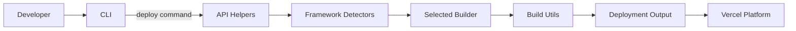

# Repository Overview

Vercel is a monorepo for the Vercel platform, housing the CLI, build utilities, runtime builders, and supporting tooling used to develop, deploy, and manage applications on Vercel's infrastructure.

# Directory and File Structure

```
/ (root)
├── api/                   # API server helpers and scripts for platform operations
├── errors/                # Common error classes and messages
├── examples/              # Sample projects illustrating framework integrations
├── internals/             # Internal utilities and shared scripts
├── packages/              # Core packages (CLI, builders, runtimes, framework detectors)
├── scripts/               # Repository-wide helper scripts
├── test/                  # Unit and integration test suites
├── utils/                 # Shared build and packaging utilities
├── package.json           # Monorepo dependencies and scripts
└── tsconfig.base.json     # Base TypeScript configuration
```

# Core Components

- **CLI (`packages/cli`)**
  - Node.js command-line interface for deploying and managing Vercel projects.
  - Communicates with `api/` helpers and Vercel's remote services.
  - Implements commands for deployment, environment management, and configuration.
- **Build Utilities (`packages/build-utils`)**
  - Shared library used by builders to prepare deployments.
  - Provides file tracing, bundling, and output generation.
- **Framework Builders (`packages/node`, `packages/next`, `packages/python`, `packages/go`, etc.)**
  - Individual runtime or framework adapters used during builds.
  - Each builder consumes `build-utils` and exports a build interface understood by Vercel.
- **Framework Detection (`packages/frameworks`, `packages/fs-detectors`)**
  - Detects user project frameworks and selects appropriate builder.
  - Scans file systems and configuration to infer framework presets.
- **Edge and Functions (`packages/edge`, `packages/functions`)**
  - Implements Edge Runtime and serverless function helpers.
  - Handles request routing, middleware, and execution environment.
- **Error Utilities (`errors/`, `packages/error-utils`)**
  - Provides consistent error classes and formatting across packages.

# Data Flow or Control Flow



- The developer interacts with the CLI which invokes API helpers.
- Project files are analyzed by framework detectors to choose a builder.
- Builders use build utilities to produce deployment artifacts uploaded to the platform.

# External Dependencies

- **Node.js & TypeScript** – Primary runtime and language for repository packages.
- **pnpm** – Package manager coordinating the monorepo.
- **Turbo** – Task runner orchestrating builds, tests, and type checks.
- **Jest/Vitest** – Testing frameworks for unit and integration tests.
- **ESLint & Prettier** – Linting and formatting tools enforcing code style.

# Notable Design Decisions

- **Monorepo Architecture**: All platform packages and builders live in a single repository managed via `pnpm` workspaces for shared development and atomic versioning.
- **Builder Abstraction**: Each framework or runtime uses a standardized build interface enabling consistent deployment behavior across diverse environments.
- **Task Orchestration with Turbo**: Builds and tests are parallelized using Turbo to speed up development in the large codebase.

# Limitations or Warnings

- Running the full test suite or integration tests requires valid Vercel credentials and may be resource-intensive.
- The repository assumes a Unix-like environment with Node.js ≥14 and may require additional setup for other platforms.

# Error Handling

- Uniform error classes are provided in `errors/` and `packages/error-utils`, promoting consistent error messages.
- Many packages include their own validation and error-reporting mechanisms to surface deployment issues quickly.
